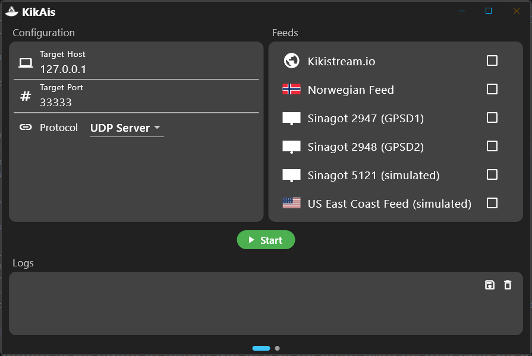
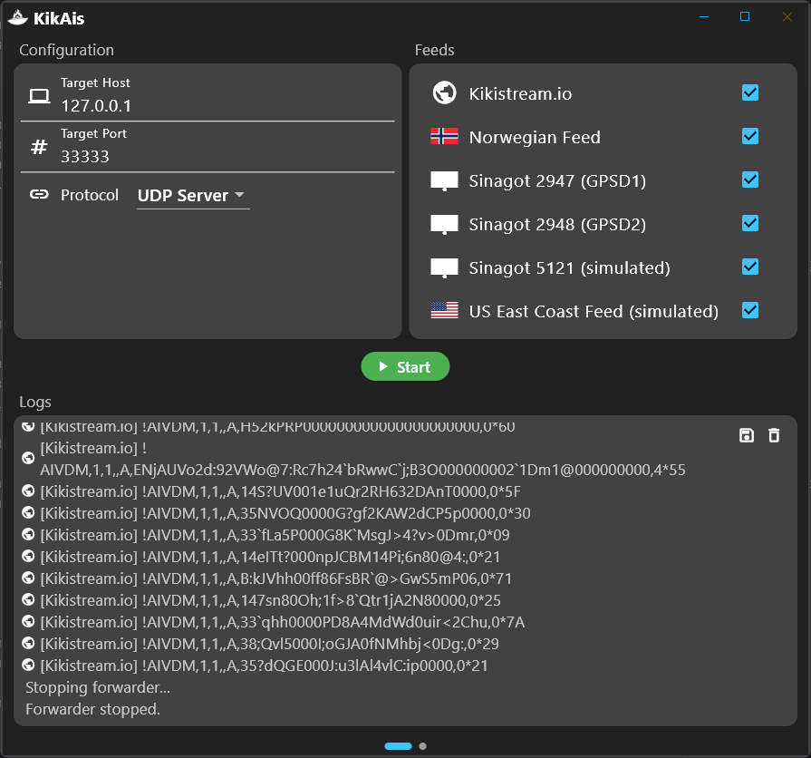
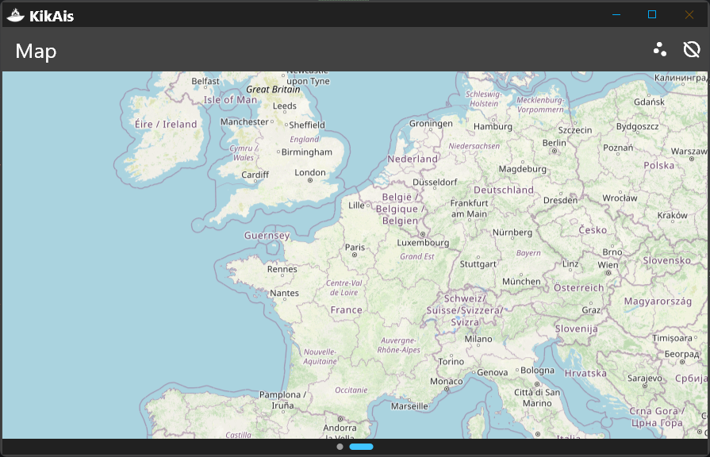
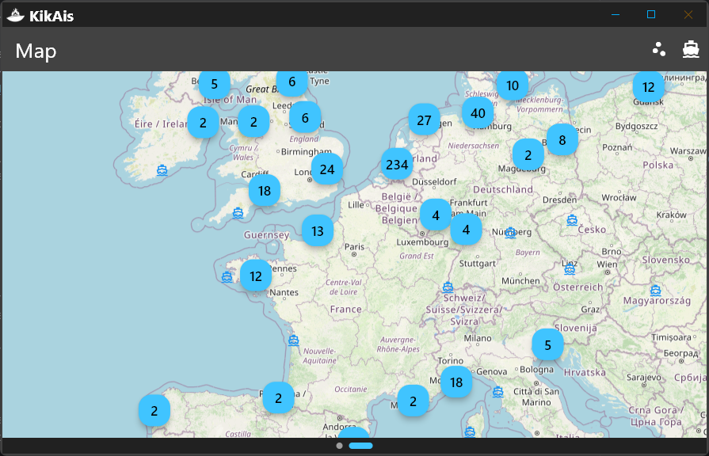
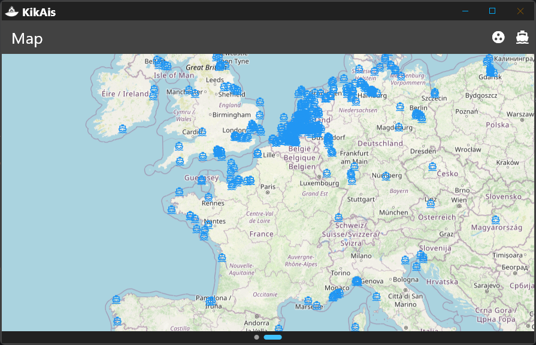
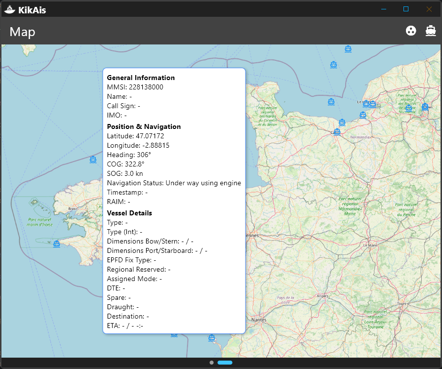

# KikAis

**AIS data forwarding & visualization hub for NMEA 0183**

Receive, decode, visualize and rebroadcast Automatic Identification System (AIS) data — all in one desktop app.

[-%23f97316)](LICENSE)

## About

KikAis is a desktop application built with **Flutter** that acts as a central hub for AIS **NMEA 0183** data. It connects to one or more data feeds, decodes the vessel information in real time, displays it on a world map, and forwards the raw stream to any number of destinations.

The application's core function is dual-layered:

1. **Forwarding** — it manages low-level network connections and rebroadcasts the aggregated AIS data over **UDP/TCP** (server & client).
2. **Processing** — it decodes NMEA 0183 sentences to extract vessel information and visualizes their live positions on an interactive world map.

This architecture keeps data handling performant while maintaining a responsive, informative user interface.

## ✨ Features

### 📡 Reception
- Built-in and user-defined **network feeds**, plus **file feeds** that replay a saved NMEA log as a live stream
- Live **log console** with per-frame copy, save-to-file and clear
- **Checksum validation** toggle with a live dropped-sentence counter
- Per-feed **status dots** (grey / red / orange / green) with message counts

### 🚀 Forwarding
- Send the aggregated AIS stream to **multiple destinations** simultaneously
- **UDP Server / UDP Client / TCP Client / TCP Server** transports
- Each destination is independently enabled and edited while the forwarder is stopped

### 🗺️ Map
- Live positions of all decoded vessels on an interactive world map
- **Marker clustering**, **vessel trails** and **speed vectors**
- Vessel **search** (name / MMSI / IMO) and **filters** (type, navigation status, country, SOG range, named only)
- Detail panel with full vessel data and a per-vessel **frame log**
- Multiple free basemaps (CARTO, OpenStreetMap, OpenTopoMap, Esri…) with an auto follow-theme option

### ✏️ Editor
- Compose and send messages of **all 27 AIS message types**
- Live NMEA preview with copy, plus inject-to-map or send-to-target actions
- **Application Specific Messages** (ASM): a catalog of **148 DAC/FID messages** with a searchable preset picker, per-type filtering and structured field editing (raw bytes or ASM fields toggle); free-text messages accept the text directly

### 🔍 Tools
- A hub of AIS/NMEA utilities with a side rail:
  - **NMEA decoder** — paste and decode one or more sentences, multi-part messages regrouped with full field-by-field breakdown
  - **Checksum** — compute / verify / fix NMEA XOR checksums
  - **MMSI lookup** — validate and identify an MMSI (MID country, station type)
  - **Speed converter** — kn · km/h · m/s · mph
  - **Binary inspector** — payload down to bits (hex, bytes, 6-bit characters)
  - **ETA calculator** — distance + speed → AIS type-5 ETA fields
  - **Radio range** — VHF-AIS radio horizon between antennas
  - **Text to binary** — free text → AIS 6-bit ASCII, hex and byte list

### 📊 Stats
- KPI cards: received / decoded rates, invalid checksums, dropped & pending fragments, parse errors
- Received-vs-decoded chart over the last minute
- **Accounting** view reconciling the received and decoded counters
- Per-feed and per-message-type breakdowns

### 🧪 Simulation
- Generate a **configurable fleet** of vessels around a chosen location
- Vessels, SAR aircraft, base stations and aids to navigation
- Position reports, static/voyage data, configurable speed, radius, interval and seed

### ⚙️ Extras
- **Isolate-based decoding** keeps the UI fluid even on high-volume streams
- Light / dark / high-contrast **themes**
- **Automatic updates** on Windows (WinSparkle), with a manual **"Check for updates"** button in the top bar; a green badge appears next to the version number when a new release is available — click it to update
- Portable executable, installer and zip distributions

## 📸 Screenshots

| Main page | Console / Logs |
|---|---|
|  |  |

| Map page | Map with clustering |
|---|---|
|  |  |

| Map without clustering | Vessel data |
|---|---|
|  |  |

## 🌍 Internationalization

KikAis is available in **10 languages**: English (default), Français, Español, Deutsch, Português, Italiano, Nederlands, 中文, 日本語 and Русский. The UI follows the **operating system language** by default and can be changed at any time with the **language button** in the top bar (next to the theme button). See [`docs/i18n.md`](docs/i18n.md) for the full developer documentation on how strings, plurals and the translation workflow work.

## ⬇️ Download & Install

Grab the latest release from the [Releases page](https://github.com/KikiManjaro/KikAis/releases) or the [download page](https://kikimanjaro.github.io/KikAis/):

| Platform | File | Notes |
|---|---|---|
| Windows | `kikais-setup-<version>.exe` | Per-user installer, **auto-updates** on by default |
| Windows | `kikais-windows-<version>-portable.exe` | Single-file portable executable, no install |
| Windows | `kikais-windows-<version>.zip` | Raw release bundle |
| Linux | `kikais-linux-<version>.tar.gz` | Linux release bundle |

## 🚀 Quick Start

1. Open the **Reception** tab and enable one or more feeds.
2. Press **Start** to launch the forwarder.
3. Open the **Map** tab and toggle "Show decoded vessels" (top-right) to see the live fleet.
4. Head to the **Send** tab to configure where the stream is forwarded.

## 🏗️ Architecture

AIS messages arrive continuously and need rapid updates to both the UI logs and the map markers. To keep the interface responsive:

- The **BoatManager** holds the central vessel collection (`Map<int, Boat>`) and updates the relevant boat on every incoming message.
- Message decoding is offloaded to a **dedicated isolate**, so the UI never blocks — even under heavy data load.
- The main window is a single view built around an **IndexedStack** inside `SwipperUi`, switched through a NavigationBar with **seven tabs** (Reception, Send, Map, Editor, Decoder, Stats, Simulation).
- The map renders vessels through a custom canvas layer for smooth drawing of thousands of markers.

## Known Bugs & Roadmap

### Known bugs

- The app will sometimes not boot on Linux (tested on Raspberry Pi); retrying to boot a few times solves the issue
- The map page could be laggy when receiving too much data
- **Windows: micro-freezes / stalls on clicks and tab switches** (Skia renderer). Skia compiles shaders at runtime on first use, which stalls the GPU on interactions (button presses, feed checkboxes, tab switches). Measured via the VM timeline: ~27-70 ms frames on clicks and ~1.3 s stalls when a page mounts; `SkSL::Compiler::convertProgram` / `driver_link_program` / `cache_miss` events fire on every interaction. **Impeller** (precompiled shaders) removes them completely, but in Flutter 3.44 Impeller is opt-in on Windows and cannot be baked into a release build (no engine-switch API in the runner; the `FLUTTER_ENGINE_SWITCHES` env vars are ignored by release builds). For development, run with `flutter run --enable-impeller` (the IntelliJ run configuration already includes it). Release builds keep a first-use stall until Impeller becomes the Windows default.
- **Windows: Tooltip widgets removed** to avoid a Flutter engine crash. `ListView` + `Tooltip` combinations desynchronize the Windows accessibility (`ui::AXTree`) bridge (flutter/flutter#182444), eventually crashing the process with an access violation in `flutter_windows.dll`. The app's tooltips were removed as a workaround; the fix is tracked upstream (flutter/flutter PR #190344). This is why "make tooltips work" is in the roadmap below.
- **Windows: `auto_updater` logs a "non-platform thread" warning** (`dev.leanflutter.plugins/auto_updater_event`). A known limitation of the `auto_updater` plugin (1.0.0, leanflutter/auto_updater#68): WinSparkle callbacks fire on a background thread. Confirmed by A/B testing that this is **not** the cause of the previous self-close crashes; it is a benign log warning for now.

#### Debugging notes (what was investigated and tried)

During a crash/performance investigation (Flutter 3.41 → 3.44.9), the following was measured and ruled in/out:

- **Self-close crashes** (Windows): root cause was the accessibility/Tooltip engine bug above. `auto_updater` was ruled out (reproduced the crash with it disabled), as were the per-frame feed-status rebuilds.
- **Click / tab-switch micro-freezes**: root cause is Skia shader compilation (see above). Impeller fixes it in dev builds.
- The following performance experiments were tried and later **reverted** because they did not resolve the perceived micro-freezes: throttling feed-status notifications, debouncing `AppSettings.save()`, gating the reception status timer on the forwarder state, gating `MessageStats` notifications on counter changes, lazy-mounting the `IndexedStack` pages + `TickerMode`, narrowing the simulation page's `ListenableBuilder`, and scoping the feed-card rebuilds to per-tile status dots.
- Kept fixes: Tooltip removal + `InkRipple.splashFactory` (avoid the `ink_sparkle` shader that also failed in tests) to prevent the crashes, and deferring `BoatManager` settings sync to the first post-frame (avoids the "setState() during build" assertion at startup).

### Improvements

- Logs processing for NMEA sentences and connection state are in the same pipeline causing some issues between them since there is only one processor — this should be reworked
- Add the ability to filter what is forwarded (by message type, geographic zone, vessel, etc.)
- Support for NMEA 4.0
- Improve compatibility with other platforms (macOS, iOS and Android)
- Make verification for memory leaks and performances
- Find a way to make tooltips works
- Add support for rtl-sdr antenna (including rtlsdrblog and others cf. https://github.com/rtlsdrblog/rtl-sdr-blog/releases)
- Make some research on other way to provide ais input
- faire une boucle de test avec aidecoder ou autre (pyais etc)

## 🤝 Contributing

Contributions are welcome! Feel free to open an [issue](https://github.com/KikiManjaro/KikAis/issues) for bugs or feature requests, or submit a pull request.

## ☕ Support

If you like KikAis and want to support its development, you can buy me a coffee:

You can also sponsor me on [GitHub Sponsors](https://github.com/sponsors/KikiManjaro).

## 📄 License

KikAis is distributed under a **custom source-available license**: you may freely use the software, but you may **not** copy, redistribute, or resell it — in whole or in part, free or for profit. See [LICENSE](LICENSE) for the full terms.